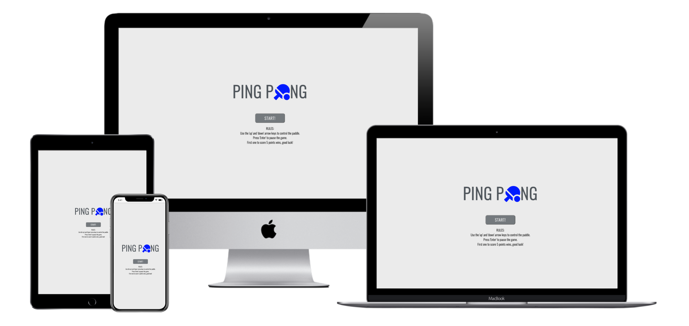
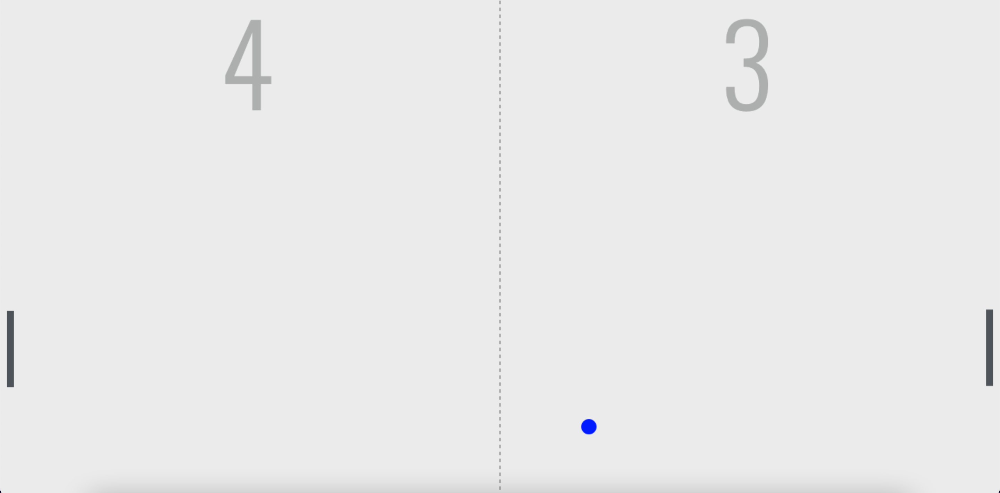

# Ping Pong

Ping Pong is an interactive clone of the original arcade game that allows users to play against the computer and paddle a ball back and forth whilst a winner is determined by the score.

Users will be able to play multiple rounds with increased difficulty until one of the players reaches 5 points, making them the winner. I have created it using a desktop first approach and it is targeted towards people who enjoy playing arcade games and are up for a challenge.

Link to game - <a href="https://sarshaheen.github.io/Ping-Pong-Game/" target="blank" rel="noopener" aria-label="Visit Ping Pong game(Opens in a new tab)"> Click Here!</a>

## User Stories

As a user, i want to be able to:

- Have clear instructions on how to play.
- Be able to play multiple rounds.
- See the scoreboard clearly.
- Control the paddle easily.

## Features

- __Header__

The Header appears at the center of the page, showing the game name (Ping Pong) in the center.

The simple colors, font and icon used work well with the background and the it is easily readable for all users.

- __Start Up Page__

The start up page includes instructions on how to play and an option to start the game. This is included as a interactive button so that the user can choose to start playing when they are ready.

It also displays the game rules underneath so the user can understand how the game works and which controls to use.

-__Pause Menu__

An option to pause the game is also available if needed by pressing the 'Enter' key. Again, the page features two interactive buttons to either continue playing or restart the game. This allows the user to keep track of their score without starting over if they take a break, or if a new tab is opened in the browser.

- __Game Score__

When the game is in progress, the JavaScript code will begin to move the computers paddle along with the ball so that the user may try to score. It will determine the points in the scoreboard above depending on which side the ball has passed through on. The score is clearly displayed so that the user can continue to play with ease and have a clear understanding of who is in the lead. 

## Testing

I have tested this game in different browsers to ensure it works with Chrome,Safari etc...

I have ensured this project is responsive and functional by using devtools toolbar.

I confirm that the text and design displayed throughout the game is visable to users. 

I have made sure that the scoreboard shows the correct score once the game is in progress.

### User Story Testing 

- Have clear instructions on how to play: Upon opening the game, i am presented with clear instructions to follow and a option to start the game.

- Be able to play multiple rounds: With each point, i able to continue playing as the difficulty is increased slightly and one of us reaches 5 points declaring the winner.

- See the scoreboard clearly: I can clearly see that the scoreboard is updated according to who is in the lead.

- Control the paddle easily: I am able to move the paddle up and down with the arrow keys on my keyboard. This makes it easy to control the movement of where i want the paddle to go.

### Bugs

I came across a issue where i was having trouble getting the computers paddle to move with the ball position. After going over to StackOverflow, i realised my mistake in the code was that i needed to match the paddle with the height of ballpositionX and not ballpositionY. After correcting this, paddle two was functioning as it should.

### Validator Testing

- __HTML__

I can confirm no errors are returned after passing the offical W3C validator.

- __CSS__

I can confirm no errors are returned after passing the Jigsaw validator.

### Unfixed Bugs

No unfixed bugs.

## Version Control

### Git & Github

I used GitPod as a IDE and local repository & GitHub as a remote repository. The process was as follows:
- I created a new repository on GitHub.
- Then, i had opened that repository on GitPod and started coding.
- In GitPod i had created the folders and pages.
- I then started saving my work and pushing it to the GitHub repository to keep it safe.
- The process for saving, commiting and pushing it to remote repository was to (done in terminal): 
  - `git add . ` for adding work to git.
  - `git commit -m "Commit message" ` to commit the work on the stage.
  - `git push ` to push work up to GitHub.

## Deployment

This site has been deployed through GitHub pages. The steps to deploy were as follows:

- In the GitHub repository, navigate to the Settings tab.
- From the source section drop-down menu, select the Main Branch.
- Once the main branch has been selected, the page will provide a link to the deployed website to view.

## Credits

I used w3School & Google to help me understand some of the JavaScript code.

### Contents

I used StackOverflow to help code the functionality of the paddle controls so it can run smoothly.

### Media

The icon used for the game header was taken from Font Awesome.
